# Fractal Explorer Studio

**Фракталы, хаос и математические эксперименты — в одном WPF-приложении для Windows.**<br>
**Fractals, chaos, and mathematical experiments in one Windows WPF application.**

[Русский](#русский) · [English](#english) · [Галерея / Gallery](Pictures/WPF/README.md) · [Лицензия / License](LICENSE)

**89 пунктов каталога · 25 трёхмерных режимов · 20 математических лабораторий**<br>
**89 catalog entries · 25 3D modes · 20 mathematical laboratories**

<p align="center">
  <a href="Pictures/WPF/00-main-catalog.png">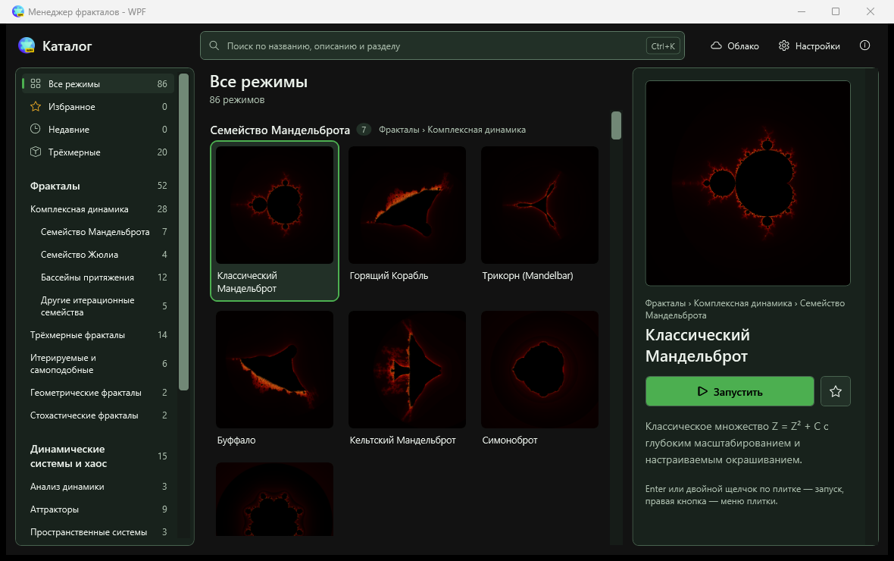</a>
</p>

## Витрина / Showcase

Настоящие скриншоты текущей WPF-версии. Нажмите на изображение для полного размера. Все рабочие окна, редакторы и диалоги — в [галерее](Pictures/WPF/README.md).

Actual screenshots of the current WPF application. Click an image to view it at full size. All exploration windows, editors, and dialogs are in the [gallery](Pictures/WPF/README.md).

<table>
<tr>
<td width="50%" align="center"><a href="Pictures/WPF/fractal3d-mandelbulb.png">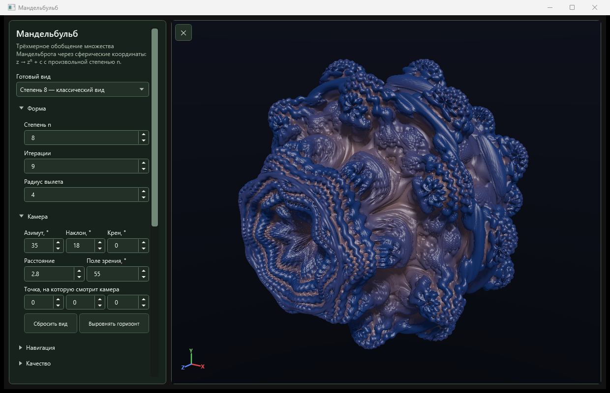</a><br><sub>Мандельбульб / Mandelbulb</sub></td>
<td width="50%" align="center"><a href="Pictures/WPF/fractal3d-kifs.png">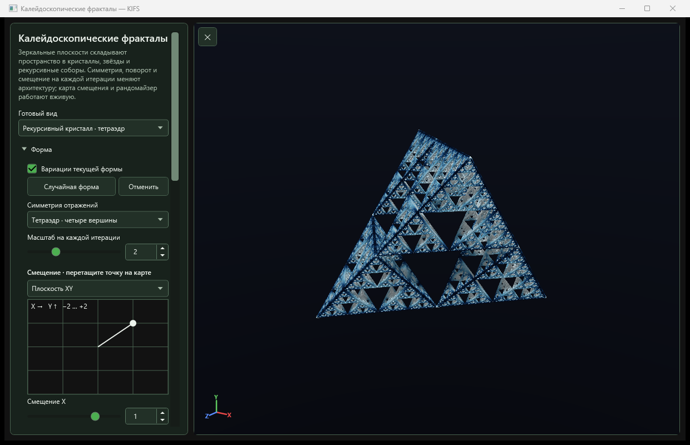</a><br><sub>Калейдоскопические фракталы / KIFS</sub></td>
</tr>
<tr>
<td width="50%" align="center"><a href="Pictures/WPF/fractal3d-flame3-d.png">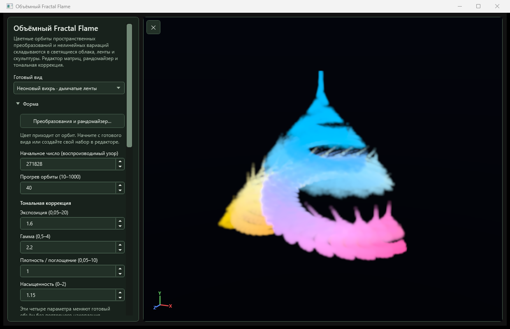</a><br><sub>Объёмный Flame / Volumetric Flame</sub></td>
<td width="50%" align="center"><a href="Pictures/WPF/fractal3d-terrain.png">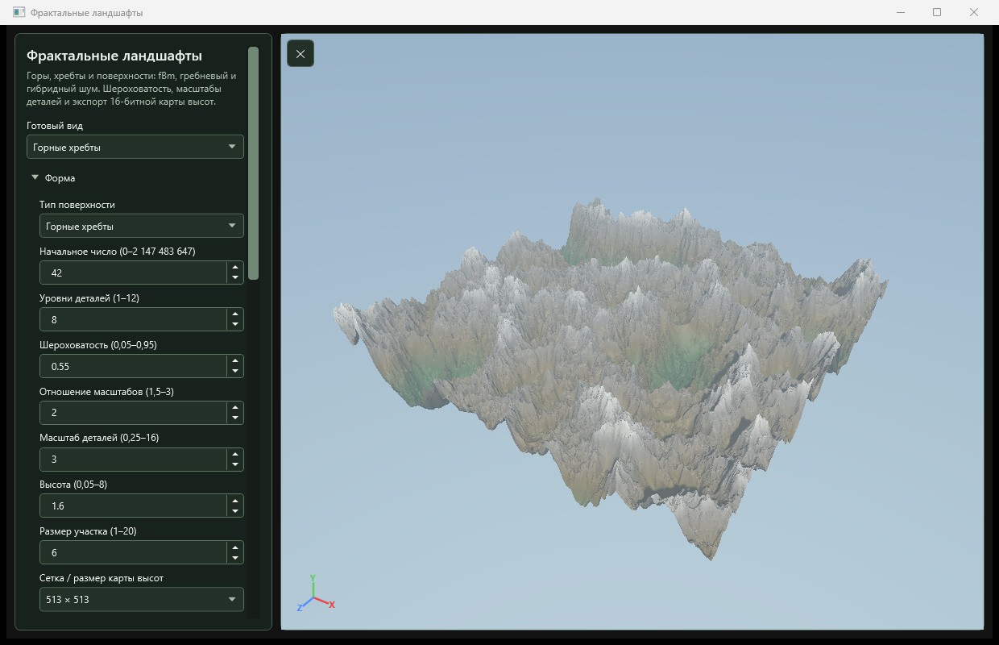</a><br><sub>Фрактальные ландшафты / Fractal terrain</sub></td>
</tr>
<tr>
<td width="50%" align="center"><a href="Pictures/WPF/fractal3d-l-system3-d.png">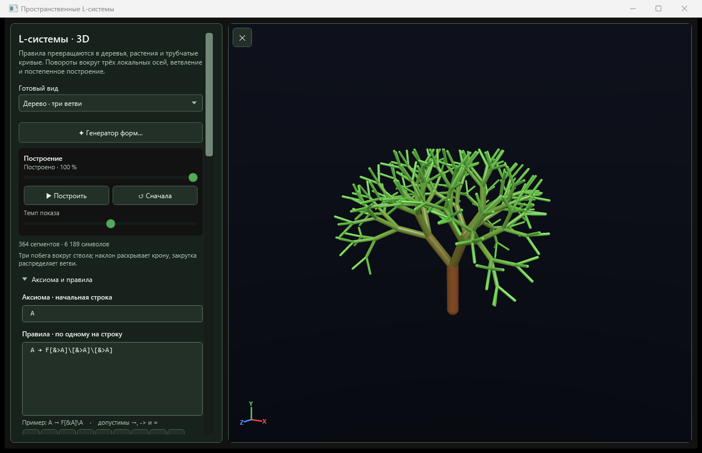</a><br><sub>Пространственные L-системы / 3D L-systems</sub></td>
<td width="50%" align="center"><a href="Pictures/WPF/fractal3d-dla3-d.png">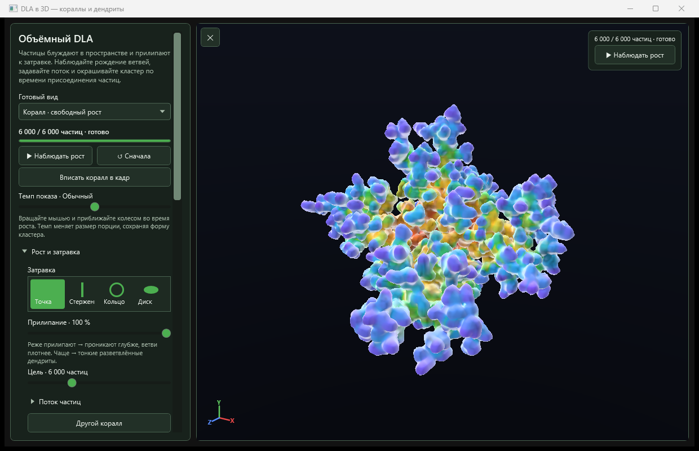</a><br><sub>Кораллы и дендриты DLA / DLA corals and dendrites</sub></td>
</tr>
<tr>
<td width="50%" align="center"><a href="Pictures/WPF/symmetric-icons.png">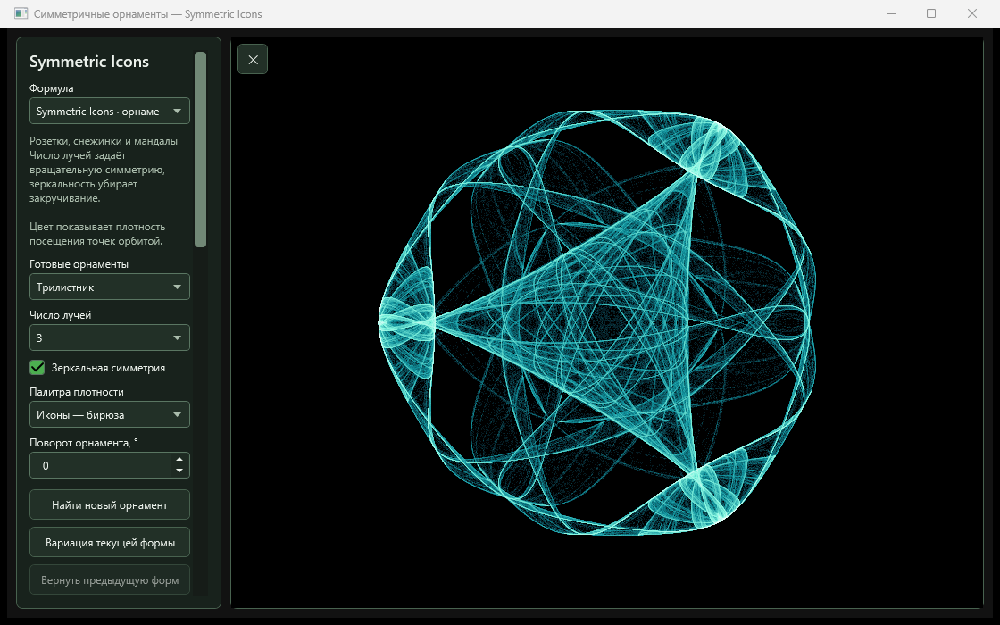</a><br><sub>Симметричные орнаменты / Symmetric Icons</sub></td>
<td width="50%" align="center"><a href="Pictures/WPF/hopalong.png">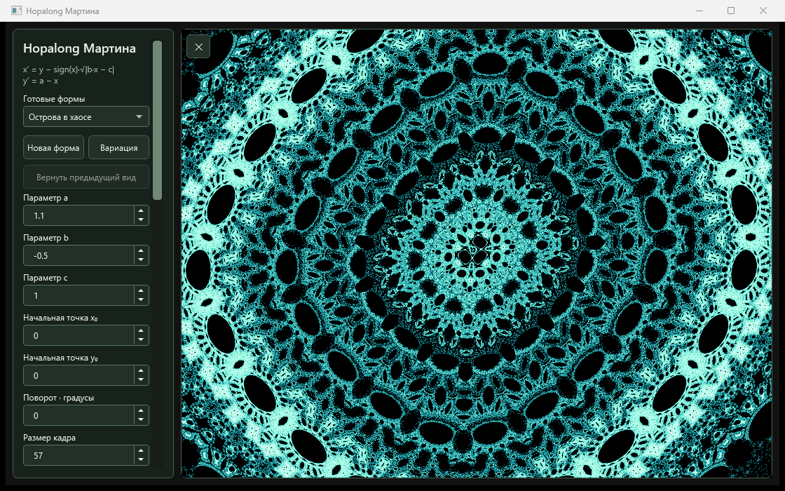</a><br><sub>Hopalong Мартина / Martin's Hopalong</sub></td>
</tr>
<tr>
<td width="50%" align="center"><a href="Pictures/WPF/turing-patterns.png">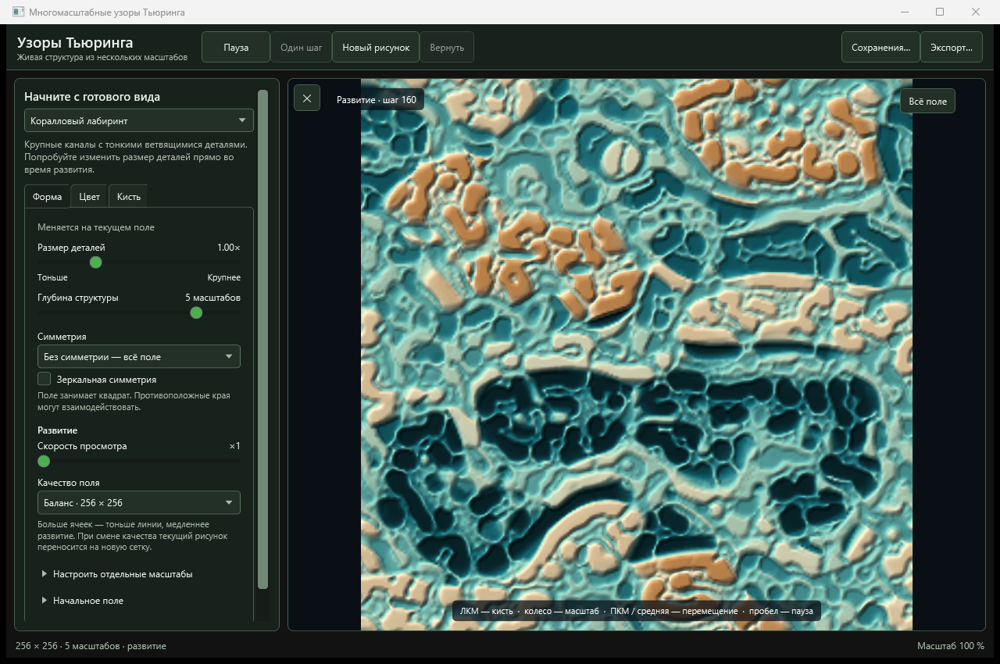</a><br><sub>Узоры Тьюринга / Turing patterns</sub></td>
<td width="50%" align="center"><a href="Pictures/WPF/snow-crystal.png">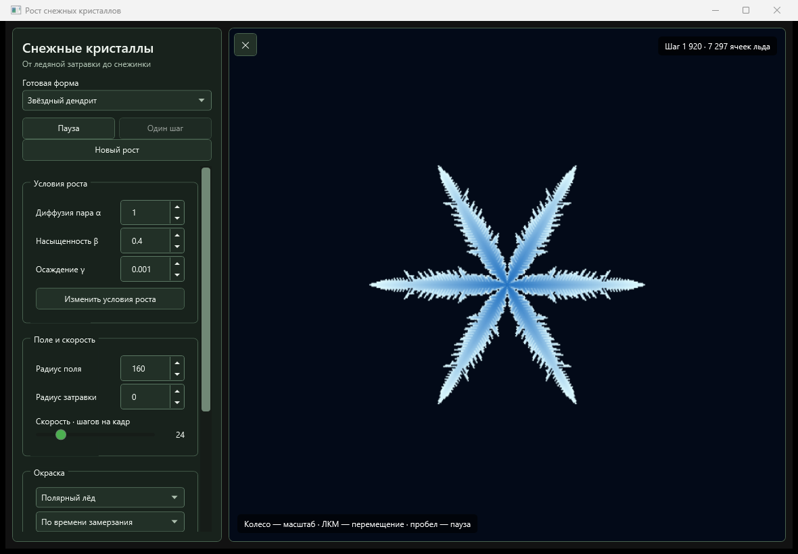</a><br><sub>Рост снежных кристаллов / Snow crystal growth</sub></td>
</tr>
<tr>
<td width="50%" align="center"><a href="Pictures/WPF/basins-magnetic-pendulum.png">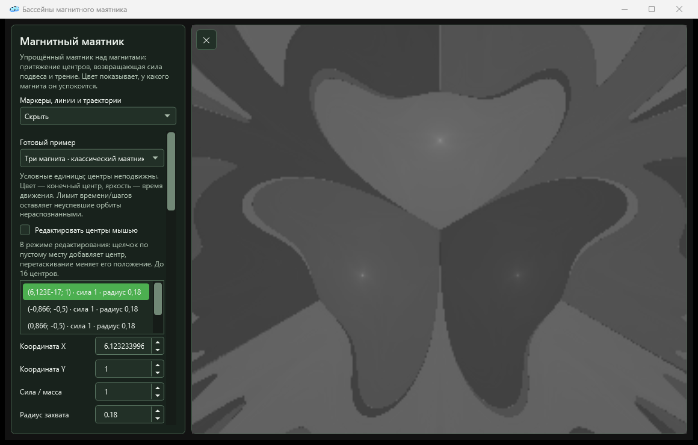</a><br><sub>Магнитный маятник / Magnetic pendulum</sub></td>
<td width="50%" align="center"><a href="Pictures/WPF/00-cloud-saves.png">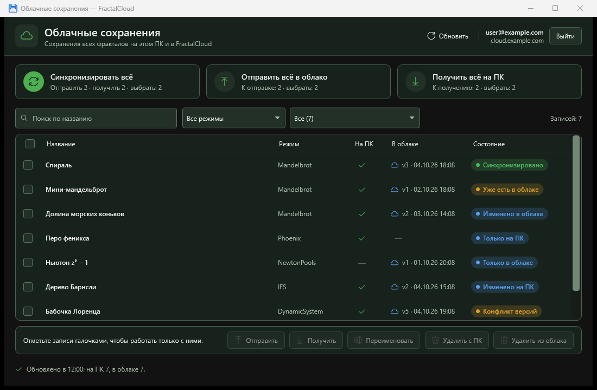</a><br><sub>Облачные сохранения: демонстрационные данные / Cloud saves: sample data</sub></td>
</tr>
<tr>
<td width="50%" align="center"><a href="Pictures/WPF/domain-coloring.png">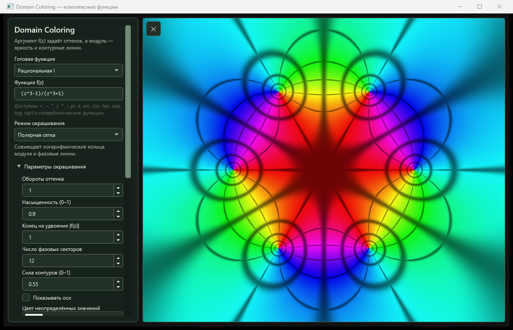</a><br><sub>Комплексные функции / Domain Coloring</sub></td>
<td width="50%" align="center"><a href="Pictures/WPF/lab-phyllotaxis.png">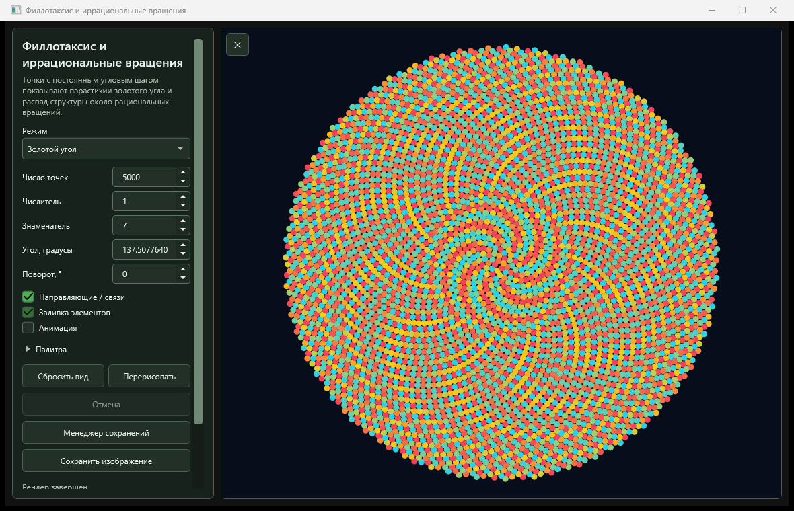</a><br><sub>Филлотаксис / Phyllotaxis</sub></td>
</tr>
</table>

<a id="русский"></a>

## Русский

Fractal Explorer Studio — интерактивная лаборатория комплексных множеств, трёхмерной геометрии, динамических систем и самоорганизующихся узоров. Выберите режим в каталоге, меняйте параметры и палитру, приближайте детали, сохраняйте найденные формы и экспортируйте изображения.

Актуальная разработка ведётся в **`FractalExplorerWPF/`**. Предыдущая WinForms-версия в `FractalExplorer/` сохранена как архив.

### Что появилось и изменилось

- **Трёхмерная лаборатория:** 20 режимов с GPU-рендерингом Direct3D 11 — от Мандельбульба и Мандельбокса до KIFS, объёмных IFS и Flame, DLA, ландшафтов и пространственных L-систем. Общая камера с режимами CAD и свободного движения, девять стилей отображения, палитры, освещение и зонд поверхности.
- **Бассейны притяжения:** Ньютон, Halley и Householder, а также 11 дополнительных режимов — Мюллер, Лагерр, секущие, рациональные отображения, периодические циклы, комплексная логистическая карта, магнитный маятник, притягивающие центры, градиентный спуск, комплексный поток и полиномиальные векторные поля. Пользовательские формулы, поиск аттракторов и просмотр траекторий.
- **Новые орбитальные узоры:** генератор квадратичных карт Спротта, Symmetric Icons, Popcorn Пиковера и Hopalong Мартина. Готовые формы, параметры, палитры; поиск и вариации там, где они поддерживаются.
- **Живые симуляции:** Gray–Scott, многомасштабные узоры Тьюринга и рост снежных кристаллов. У Тьюринга и снежных кристаллов сохранение позволяет точно продолжить эволюцию поля.
- **Конструкторы форм:** редакторы преобразований IFS и Flame в 2D/3D, правила и анимация L-систем, отдельные генераторы L-систем 2D/3D с воспроизводимыми формами и вариациями.
- **Обновлённый каталог:** поиск по названиям, описаниям и разделам, избранное, недавние, общая подборка всех 3D-режимов, фоновые превью и быстрый переключатель `Ctrl+K`.
- **Облачные сохранения FractalCloud:** единый список ПК и облака, массовые и выборочные операции, фильтры и разрешение конфликтов. Подключение требует настроенного сервера и существующего аккаунта; локальные функции доступны без облака.

### Исследование и экспорт

| Возможность | Что доступно |
| --- | --- |
| Глубокий зум | До `1e1000` у семейства Мандельброта, Phoenix и бассейнов Ньютона; до `1e50` у Nova и комплексного Коллатца. Доступная детализация зависит от формулы и области |
| Раскраска | Редактируемые палитры и градиенты; у семейства Мандельброта — Histogram, Orbit Trap, Stripe Average и Distance Estimation с освещением |
| Вычисления | Асинхронный CPU-рендеринг, настройка потоков и порядка плиток, прогресс и отмена; GPU-рендеринг для 3D |
| Сохранения | Параметры и PNG-превью, встроенные точки интереса, менеджер состояний; удалённые и заменённые сохранения отправляются в Корзину Windows |
| Экспорт | Произвольные размеры, пресеты до 8K, PNG/JPEG/BMP, SSAA, Bicubic и Lanczos 3; у ландшафтов — карта высот PNG Gray16 |
| Оформление | Встроенные и пользовательские темы, редактор темы, редакторы палитр и экранная пипетка |

### Каталог

В каталоге **89 пунктов**: 51 в разделе «Фракталы», 18 в «Динамических системах и хаосе» и 20 математических лабораторий. Подборка «Трёхмерные» объединяет 25 режимов из разных разделов — они уже входят в эти числа.

| Направление | Режимы |
| --- | --- |
| Комплексная динамика | Mandelbrot, Burning Ship, Tricorn, Buffalo, Celtic, Simonobrot, Multibrot; Julia; 12 режимов бассейнов; Phoenix, Nova Mandelbrot/Julia, Collatz, Buddhabrot/Anti-Buddhabrot |
| Трёхмерные формы | Мандельбульб, Жюлиабульб, Burning Ship 3D и Julia, Phoenix 3D, Мандельбокс, гибрид Bulb × Box, Менгер, Вицек, Кантор, тетраэдр Серпинского, кватернионное Julia, KIFS, ландшафты |
| Самоподобие и рост | IFS 2D/3D, Flame 2D/3D, Popcorn, Серпинский — игра хаоса, аполлонова упаковка окружностей/сфер, DLA 2D/3D |
| Динамика и хаос | Ляпунов, логистические орбиты, бифуркации, Лоренц, Рёсслер, Хенон, Икэда, странные 2D-аттракторы, Спротт, Symmetric Icons, Hopalong; семь систем объёмных аттракторов в одном режиме |
| Пространственные системы | Gray–Scott, многомасштабные узоры Тьюринга, снежные кристаллы |
| Теория чисел | Арифметика mod N, Паскаль mod N, рациональные числа, геометрия простых, Рекаман, обратное дерево Коллатца |
| Геометрия и комплексный анализ | Филлотаксис, инверсия/Мёбиус, апериодические мозаики, гиперболическая геометрия, Вороной/Ллойд, узлы, Domain Coloring, Kleinian/Schottky |
| Генеративная геометрия и волны | L-системы 2D/3D, Brownian motion/Lévy flights, эпициклы Фурье, фигуры Хладни и интерференция |

### Сборка и запуск

Требуются **Windows и [.NET 10 SDK](https://dotnet.microsoft.com/download/dotnet/10.0)**. Для 3D нужен совместимый с Direct3D 11 графический адаптер и драйвер. Двумерные вычислительные режимы работают на CPU.

```powershell
git clone https://github.com/xanstar6067/FractalExplorer.git
cd FractalExplorer
dotnet build .\FractalExplorerWPF\FractalExplorerWPF\FractalExplorerWPF.slnx
dotnet run --project .\FractalExplorerWPF\FractalExplorerWPF\FractalExplorerWPF\FractalExplorerWPF.csproj
```

Решение можно открыть в Visual Studio с поддержкой .NET 10 и рабочей нагрузкой разработки классических приложений .NET. NuGet-зависимости Vortice используются для Direct3D 11.

### Первые шаги и данные

1. Выберите плитку и нажмите **«Запустить»**, `Enter` или дважды щёлкните по ней.
2. Используйте `Ctrl+F` для поиска и `Ctrl+K` для быстрого переключения режима.
3. Меняйте параметры и палитру в окне исследователя; инструкции навигации доступны в самом окне.
4. Сохраните состояние через менеджер сохранений или готовое изображение через менеджер экспорта.

Пользовательские данные находятся в **`%LOCALAPPDATA%\Fractal Explorer Studio`**: сохранения с превью, палитры, темы, настройки, журналы и общий кэш 3D-шейдеров. Папка открывается из **«Настройки» → «Открыть папку с данными»** в главном окне. Превью встроенных точек интереса кэшируются отдельно; старые данные из папки `Saves` рядом с приложением переносятся миграцией.

Облако настраивается по [инструкции FractalCloud](FractalExplorerWPF/CLOUD.md). В скриншотах облачных окон используются вымышленные записи.

### Подробнее

- [Полная галерея окон и редакторов](Pictures/WPF/README.md) · [Генератор скриншотов](FractalExplorerWPF/ScreenshotGen/README.md)
- [KIFS](FractalExplorerWPF/KIFS.md) · [Flame 3D](FractalExplorerWPF/FLAME3D.md) · [DLA 3D](FractalExplorerWPF/DLA3D.md) · [Ландшафты](FractalExplorerWPF/TERRAIN.md)
- [L-системы 3D](FractalExplorerWPF/LSYSTEM3D.md) · [Генераторы L-систем](FractalExplorerWPF/LSYSTEM_RANDOMIZER.md)
- [Symmetric Icons](FractalExplorerWPF/SYMMETRIC_ICONS.md) · [Popcorn](FractalExplorerWPF/POPCORN.md) · [Hopalong](FractalExplorerWPF/HOPALONG.md)
- [Снежные кристаллы](FractalExplorerWPF/SNOW_CRYSTALS.md) · [Узоры Тьюринга](FractalExplorerWPF/TURING_PATTERNS.md)
- [Облако](FractalExplorerWPF/CLOUD.md) · [Темы](FractalExplorerWPF/FractalExplorerWPF/FractalExplorerWPF/Theming/README.md) · [Проверки](FractalExplorerWPF/Verification/README.md)

---

<a id="english"></a>

## English

Fractal Explorer Studio is an interactive laboratory for complex sets, 3D geometry, dynamical systems, and self-organizing patterns. Choose a catalog entry, adjust its parameters and palette, explore the details, save interesting forms, and export images.

Active development takes place in **`FractalExplorerWPF/`**. The earlier WinForms implementation in `FractalExplorer/` is retained as an archive.

### What's new

- **3D laboratory:** 20 Direct3D 11 GPU-rendered modes, from Mandelbulb and Mandelbox to KIFS, volumetric IFS and Flame, DLA, terrain, and spatial L-systems. Shared CAD/free-movement camera, nine shading styles, palettes, lighting, and a surface probe.
- **Attraction basins:** Newton, Halley, and Householder, plus 11 additional modes: Müller, Laguerre, secant, rational maps, periodic cycles, complex logistic map, magnetic pendulum, attracting centers, gradient descent, complex gradient flow, and polynomial vector fields. Custom expressions, attractor discovery, and trajectory inspection.
- **Orbit patterns:** Sprott quadratic-map generator, Symmetric Icons, Pickover's Popcorn, and Martin's Hopalong, with presets, parameters, palettes, and search/variation tools where supported.
- **Live simulations:** Gray–Scott, multiscale Turing patterns, and snow crystal growth. Turing and snow crystal saves can resume the exact field evolution.
- **Shape constructors:** 2D/3D IFS and Flame transform editors, L-system rules and growth animation, and separate 2D/3D L-system generators with reproducible forms and variations.
- **Updated catalog:** search across names, descriptions, and categories, favorites, recent modes, a cross-category 3D collection, background previews, and the `Ctrl+K` quick switcher.
- **FractalCloud saves:** a unified local/cloud list, batch and selective operations, filters, and conflict resolution. Cloud access requires a configured server and an existing account; local features work independently.

### Exploration and export

| Feature | Capabilities |
| --- | --- |
| Deep zoom | Up to `1e1000` for the Mandelbrot family, Phoenix, and Newton basins; up to `1e50` for Nova and complex Collatz. Available detail depends on the formula and region |
| Coloring | Editable palettes and gradients; Histogram, Orbit Trap, Stripe Average, and lit Distance Estimation for the Mandelbrot family |
| Rendering | Asynchronous CPU computation, thread/tile-order settings, progress, and cancellation; GPU rendering for 3D |
| Saved states | Parameters and PNG previews, built-in points of interest, a save manager; deleted and replaced saves go to the Windows Recycle Bin |
| Image export | Custom dimensions, presets up to 8K, PNG/JPEG/BMP, SSAA, Bicubic, and Lanczos 3; PNG Gray16 height maps for terrain |
| Appearance | Built-in and custom themes, a theme editor, palette editors, and a screen eyedropper |

### Catalog

The catalog has **89 entries**: 51 fractal entries, 18 dynamical-system entries, and 20 mathematical laboratories. The **25 3D modes** span these sections and are already included in their counts.

| Area | Modes |
| --- | --- |
| Complex dynamics | Mandelbrot, Burning Ship, Tricorn, Buffalo, Celtic, Simonobrot, Multibrot; Julia; 12 basin modes; Phoenix, Nova Mandelbrot/Julia, Collatz, Buddhabrot/Anti-Buddhabrot |
| 3D forms | Mandelbulb, Juliabulb, Burning Ship 3D and Julia, Phoenix 3D, Mandelbox, Bulb × Box hybrid, Menger, Vicsek, Cantor, Sierpiński tetrahedron, quaternion Julia, KIFS, terrain |
| Self-similarity and growth | 2D/3D IFS, 2D/3D Flame, Popcorn, Sierpiński chaos game, Apollonian circle/sphere packing, 2D/3D DLA |
| Dynamics and chaos | Lyapunov, logistic orbits, bifurcation, Lorenz, Rössler, Hénon, Ikeda, strange 2D attractors, Sprott, Symmetric Icons, Hopalong; seven volumetric attractor systems in one mode |
| Spatial systems | Gray–Scott, multiscale Turing patterns, snow crystals |
| Number theory | Modular arithmetic, Pascal mod N, rational numbers, prime geometry, Recamán, inverse Collatz tree |
| Geometry and complex analysis | Phyllotaxis, inversion/Möbius, aperiodic tilings, hyperbolic geometry, Voronoi/Lloyd, knots, Domain Coloring, Kleinian/Schottky |
| Generative geometry and waves | 2D/3D L-systems, Brownian motion/Lévy flights, Fourier epicycles, Chladni figures and interference |

### Build and run

Requires **Windows and the [.NET 10 SDK](https://dotnet.microsoft.com/download/dotnet/10.0)**. 3D modes require a Direct3D 11-compatible graphics adapter and driver. The 2D computational modes run on the CPU.

```powershell
git clone https://github.com/xanstar6067/FractalExplorer.git
cd FractalExplorer
dotnet build .\FractalExplorerWPF\FractalExplorerWPF\FractalExplorerWPF.slnx
dotnet run --project .\FractalExplorerWPF\FractalExplorerWPF\FractalExplorerWPF\FractalExplorerWPF.csproj
```

You can also open the solution in Visual Studio with .NET 10 support and the .NET Desktop Development workload. The Vortice NuGet dependencies provide Direct3D 11 bindings.

### Getting started and user data

1. Select a tile and click **Launch**, press `Enter`, or double-click it.
2. Use `Ctrl+F` to search and `Ctrl+K` to switch modes quickly.
3. Adjust parameters and palettes in the explorer window; navigation hints are available in each window.
4. Save a state through the save manager or export an image through the export manager.

User data lives in **`%LOCALAPPDATA%\Fractal Explorer Studio`**: saves and previews, palettes, themes, settings, logs, and the shared 3D shader cache. Open it from **Settings → Open data folder** in the main window. Built-in point-of-interest previews are cached separately; older data from the `Saves` folder beside the executable is imported by migration.

See the [FractalCloud guide](FractalExplorerWPF/CLOUD.md) for cloud configuration. Cloud screenshots contain fictional sample records. Detailed mode documentation is linked in the [Russian section](#подробнее); the [full screenshot gallery](Pictures/WPF/README.md) has bilingual captions.

## Структура репозитория / Repository layout

```text
FractalExplorerWPF/
  FractalExplorerWPF/   актуальное WPF-решение / active WPF solution
  ScreenshotGen/       генератор снимков / screenshot generator
  Verification/        автоматические проверки / verification tools
Pictures/WPF/          актуальная галерея / current screenshot gallery
Pictures/V2_0_WPF/     предыдущие снимки / previous screenshots
FractalExplorer/       архив WinForms / WinForms archive
```

## Лицензия / License

[Apache License 2.0](LICENSE).
